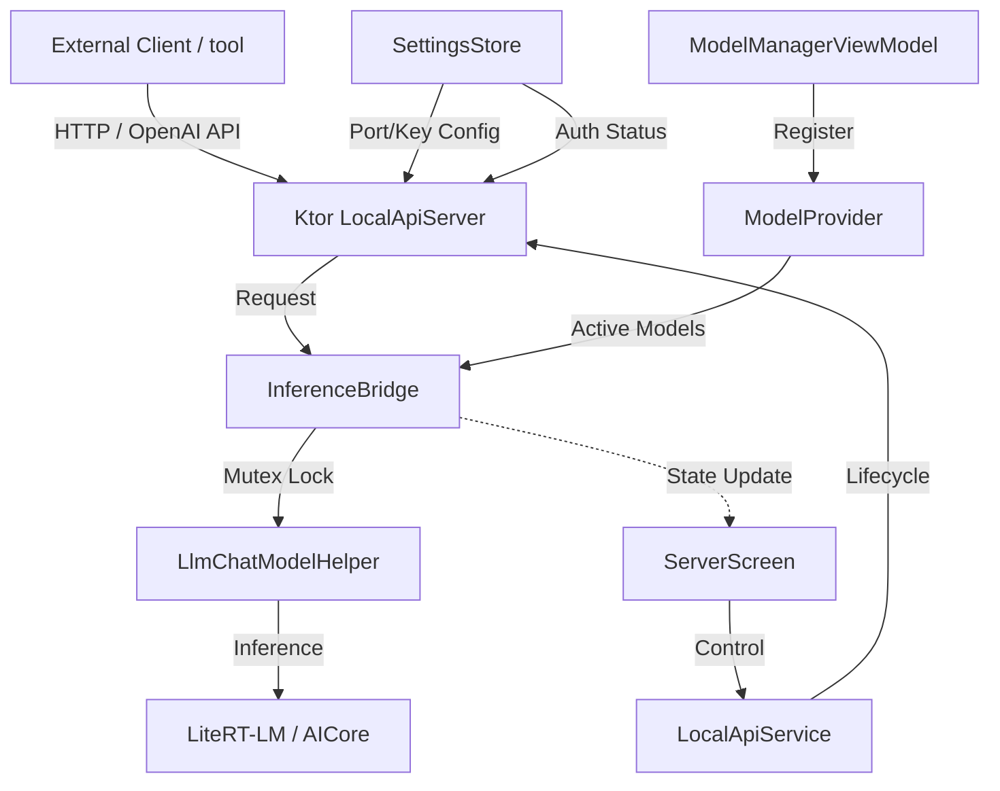

# Local AI API Server Walkthrough

This walkthrough details the integration of an OpenAI-compatible local API server into the Google AI Edge Gallery Android application. This feature allows external applications and tools to leverage the on-device LLM models via standard HTTP requests.

## 1. Architecture Overview

The system consists of several layers bridging the Android environment with the Ktor-based HTTP server:



## 2. Core Components

### 🔄 Inference Bridge (`InferenceBridge.kt`)
The bridge converts OpenAI-compatible `ChatCompletionRequest` objects into on-device inference calls.
- **Concurrency**: Uses a global `Mutex` to ensure only one inference runs at a time (as LiteRT-LM is single-threaded for inference).
- **Streaming**: Supports Server-Sent Events (SSE) for real-time token streaming.
- **Cancellation**: If a client disconnects, the bridge triggers `stopResponse()` on the model to free resources immediately.

### 🌐 Local API Server (`LocalApiServer.kt`)
A lightweight Ktor server running on Netty.
- **Endpoints**:
  - `GET /v1/models`: Lists all currently loaded/initialized models.
  - `POST /v1/chat/completions`: Standard OpenAI chat completion endpoint.
- **Authentication**: Optional Bearer token validation (configured in settings).

### 🔋 Foreground Service (`LocalApiService.kt`)
Ensures the server remains active even when the app is in the background.
- **Persistence**: Uses a Foreground Service with `specialUse` type.
- **IP Detection**: Automatically detects the local WiFi/Hotspot IP address for external access.
- **Notifications**: Provides persistent status notifications with the server URL.

### 📱 Premium Management UI (`ServerScreen.kt`)
A dedicated screen to manage the server lifecycle and security.
- **Real-time Status**: Visual indicators for starting, running, or error states.
- **Security**: Generate and copy API keys.
- **Usage Guide**: Built-in `curl` example with the current IP and Port.

## 3. How to Use

### 1. Enable the Server
1. Open **Settings** from the Home Screen.
2. Tap **Local API Server**.
3. Set a **Port** (default 8080) and optionally generate an **API Key**.
4. Tap **Start Server**.

### 2. Configure a Client
You can now point any OpenAI-compatible client to your phone's IP.

**Example Curl:**
```bash
curl http://192.168.1.15:8080/v1/chat/completions \
  -H "Content-Type: application/json" \
  -H "Authorization: Bearer sk-your-key" \
  -d '{
    "model": "gemma-2b-it-cpu-int4",
    "messages": [{"role": "user", "content": "Explain gravity to a 5-year old."}]
  }'
```

### 3. Compatible Tools
- **Chatbox / Open WebUI**: Just set the Base URL to your phone's IP.
- **Python OpenAI SDK**:
  ```python
  client = OpenAI(base_url="http://<PHONE_IP>:8080/v1", api_key="<YOUR_KEY>")
  ```

## 4. Security & Limitations
- **Local Network Only**: The server is only accessible on the same WiFi/Hotspot network.
- **One Model at a Time**: The app must have a model "initialized" (selected and loaded) to serve requests.
- **Hardware Bound**: Inference speed depends on the device's CPU/GPU/NPU capabilities.
